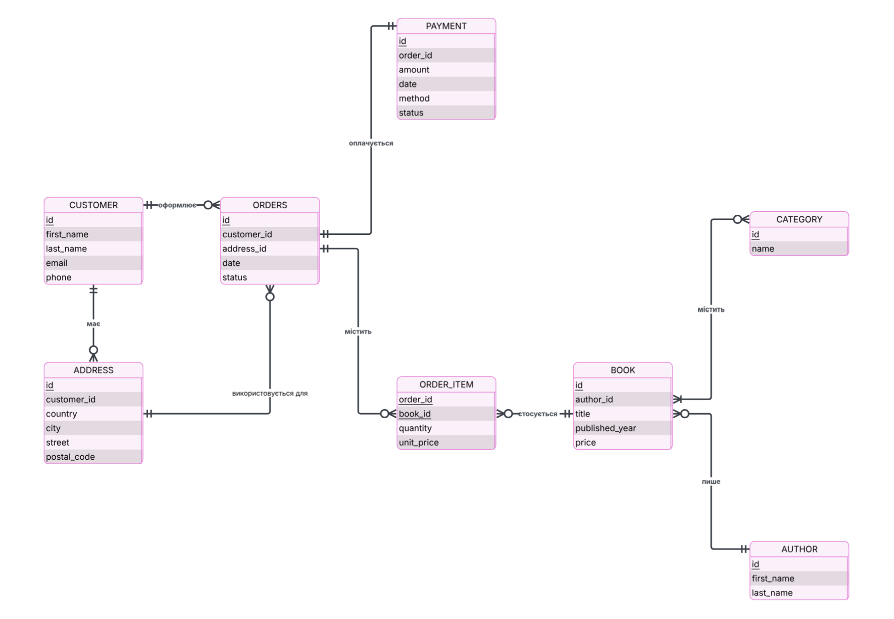

## Виклад вимог від stakeholder

Інтернет-магазин під назвою Bookly, де клієнти переглядають каталог книг за категоріями, оформлюють замовлення з кількома книгами та оплачують їх.

- Облік клієнтів: ім'я, email, телефон;
- Адреса доставки містить країну, місто, вулицю та поштовий індекс;
- Каталог книг: назва, ціна, рік видання, категорія/жанр (фентезі, наукова література т.д.);
- Клієнт оформлює замовлення, до якого входить одна або кілька книг у різній кількості;
- Кожне замовлення має один платіж, який може бути здійснений карткою або готівкою;

## Бізнес-правила

- Один клієнт може мати кілька адрес доставки, але кожне замовлення прив'язане рівно до однієї адреси доставки;
- Адреса доставки замовлення повинна належати клієнту, який оформив це замовлення;
- Замовлення не може бути порожнім (мінімум одна позиція);
- Ціна в момент замовлення (`unit_price`) фіксується окремо від поточної ціни книги, щоб зміна цін у каталозі не впливала на вже оформлені замовлення;

## Сутності та атрибути

- **Customer** (`id` (PK), `first_name`, `last_name`, `email`, `phone`);
- **Address** (`id` (PK), `customer_id`, `country`, `city`, `street`, `postal_code`);
- **Category** (`id` (PK), `name`);
- **Book** (`id` (PK), `author_id`, `title`, `published_year`, `price`);
- **Author** (`id` (PK), `first_name`, `last_name`);
- **Orders** (`id` (PK), `customer_id` (FK), `address_id` (FK), `date`, `status`);
- **Order_item** (`order_id` (PK, FK), `book_id` (PK, FK), `quantity`, `unit_price`);
- **Payment** (`id` (PK), `order_id`, `amount`, `date`, `method`, `status`).

## Зв'язки та кардинальність

- **Customer - Address: 1 to n** (клієнт може мати кілька адрес доставки адреса належить одному клієнту);
- **Category - Book: n to n** (категорія містить багато книг, а одна книга може належати до кількох категорій);
- **Author - Book: 1 to n** (один автор може написати кілька книг, але кожна книга в каталозі має рівно одного автора);
- **Customer - Orders: 1 to n** (клієнт може оформити багато замовлень, кожне замовлення належить одному клієнту);
- **Address - Orders: 1 to n** (одна адреса може використовуватися для доставки багатьох замовлень, кожне замовлення має рівно одну адресу доставки);
- **Order - Book: n to n** (замовлення містить кілька книг, одну й ту саму книгу можуть купувати в різних замовленнях) - зв'язок реалізовано через асоціативну сутність `Order_item` з атрибутами `quantity` і `unit_price`;
- **Order - Payment: 1 to 1** (кожне замовлення має один платіж).

## Припущення та обмеження

- Кожна адреса має бути пов'язана з одним клієнтом;
- Зв'язок **Category - Book** реалізовано як n to n, тому при створенні таблиць буде додана асоціативна таблиця `Book_category`, і оскільки дана асоціативна сутність не має власних атрибутів, я вирішила не показуватиїї окремою сутністю на діаграмі.
- Статус замовлення приймає одне з фіксованих значень: "нове", "збирається", "відправлено", "отримано", "скасовано";
- Адреса доставки замовлення повинна належати клієнту, який оформив це замовлення.
- Замовлення не може бути порожнім;
- Кількість однієї позиції книги в межах одного замовлення не може перевищувати 10-ти;
- Для платежу передбачено два методи: картка та готівка;
- Статус платежу може бути "очікує" або "оплачено";
- При оплаті готівкою при отриманні платіж спочатку має статус "очікує", а після отримання коштів змінюється на "оплачено";
- Одне замовлення має не більше одного платежу;

## ER-діаграма

